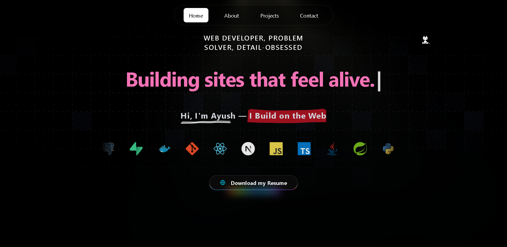

# Portfolio

A modern, fast, and accessible personal developer portfolio built with **Next.js** and a **single, carefully–crafted dark UI**.

Live Site: https://www.ayuxh.me

> This README is a living document. Suggestions are welcome—open a PR or issue.

---

## Demo

```

```

---

## Features

- ⚡ Optimized Next.js app (dynamic imports where needed, image optimization)
- 🌑 Single dark theme (no light mode UI — intentional design choice)
- 📱 Fully responsive layout (mobile-first)
- ♿ Accessibility considerations (semantic landmarks, focus management)
- 🔍 SEO & Open Graph metadata centralization
- 🧩 Modular data-driven sections (projects, skills, timeline)
- 🧪 TypeScript (if not yet added, see Roadmap)
- 🧵 Reusable component architecture
- 📈 Analytics-ready (plug in your provider)
- ✉️ Contact / social presence integration
- 🛡️ Security headers & CSP (optional; add via middleware or hosting platform)
- 🚀 Easy deployment to Vercel

---

## Tech Stack

- Framework: **Next.js**
- Runtime: Node.js
- Styling: (Add actual choice — e.g., Tailwind CSS / CSS Modules / Styled Components / Vanilla CSS)
- Icons: (e.g., Lucide / Heroicons / Custom SVGs)
- Type System: (Add TypeScript if used; otherwise mark as planned)
- Tooling: ESLint, Prettier (adjust accordingly)
- Deployment: Vercel

> Update this section as the stack evolves.

---

## Performance

Target guidelines:
| Aspect | Goal |
| ------ | ---- |
| Lighthouse Performance | ≥ 90 |
| Accessibility | ≥ 100 |
| Best Practices | ≥ 95 |
| SEO | ≥ 95 |

Recommended practices already (or to be) applied:
- Use `<Image />` from Next.js for responsive images
- Define width/height to avoid CLS
- Preload critical font(s) (if self-hosted)
- Minimize large client bundles (code-split sections if needed)
- Avoid unnecessary polyfills

---

## Project Structure

(Reflect actual tree—adjust as needed.)

```
.
├─ public/              # Static assets (favicons, images, og images)
├─ src/
│  ├─ app/ or pages/    # Route handlers (depends on Next.js version)
│  ├─ components/       # Reusable UI pieces
│  ├─ data/             # Project / skills / timeline data
│  ├─ lib/              # Utility functions (formatters, helpers)
│  ├─ styles/           # Global / design tokens
│  ├─ hooks/            # Custom React hooks
│  └─ config/           # Site metadata / navigation schema
├─ .github/workflows/   # CI workflows (lint/build/deploy)
└─ package.json
```

---

## Getting Started

### Prerequisites
- Node.js (LTS recommended)
- pnpm / yarn / npm

### Installation

```bash
git clone https://github.com/AyushBhxrdwaj/Portfolio
cd Portfolio
pnpm install   # or yarn / npm install
```

### Development

```bash
pnpm dev
```

Visit: http://localhost:3000

### Production Build

```bash
pnpm build
pnpm start
```

### Lint & (Optional) Type Check

```bash
pnpm lint
pnpm typecheck   # if TypeScript enabled
```

---

## Configuration

Create an `.env.local` file for runtime configuration (example keys—add/remove as applicable):

```
# Analytics
NEXT_PUBLIC_ANALYTICS_ID=

# Contact integration (form service or API endpoint)
CONTACT_ENDPOINT=

# External API tokens (never commit!)
GITHUB_TOKEN=
```

Never commit secrets. Use Vercel dashboard for prod values.

---

## Scripts

(Adjust to match actual `package.json`.)

| Script      | Purpose |
|-------------|---------|
| dev         | Start local development server |
| build       | Production build |
| start       | Run production server |
| lint        | Lint codebase |
| typecheck   | TypeScript noEmit check (if using TS) |
| format      | Run Prettier (or formatting tool) |
| analyze     | Bundle analysis (if configured) |

---

## Content Model

Example `src/data/projects.ts`:

```ts
export const projects = [
  {
    title: 'Project Title',
    slug: 'project-title',
    description: 'Concise summary of what it does.',
    tech: ['Next.js', 'TypeScript'],
    repo: 'https://github.com/.../...',
    live: 'https://...',
    year: 2025,
    featured: true
  }
];
```

Extend with:
- `image`
- `tags`
- `role`
- `metrics`
- `ctaLabel`

---

## Styling

Single dark theme principles:
- No UI toggle; maintain consistent brand look
- Use system-friendly contrast ratios (aim ≥ WCAG AA)
- Provide visible focus rings
- Prefer CSS custom properties for tokens (e.g., `--color-bg`, `--color-fg`, `--radius-sm`)

If using Tailwind:
- Configure dark palette directly (omit `dark:` variants if not needed)
- Keep minimal layers: base, components, utilities

If using custom CSS:
- Consider a `tokens.css` for design primitives
- Scope component styles modularly

---

## SEO

Centralize metadata (example):

```ts
export const siteMeta = {
  title: 'Ayush | Portfolio',
  description: 'Personal developer portfolio.',
  siteUrl: 'https://www.ayuxh.me',
  author: 'Ayush Bhardwaj',
  ogImage: '/og.png',
  keywords: ['Ayush', 'Developer', 'Portfolio', 'Next.js']
};
```

Enhancements:
- Open Graph & Twitter cards
- JSON-LD (Person, WebSite)
- Generate `sitemap.xml` & `robots.txt`
- Canonical URLs

---

## Deployment

### Vercel (Recommended)
1. Import repo in Vercel
2. Set environment variables (if any)
3. Default build command: `pnpm build`
4. Output: `.next`

### GitHub Actions
Add workflow (example) to run lint/build and optionally deploy.

---

## Roadmap

- [ ] Add TypeScript (if not already)
- [ ] Add unit/component tests (Vitest / Jest / React Testing Library)
- [ ] Add integration tests (Playwright / Cypress)
- [ ] Implement JSON-LD schema
- [ ] Add dynamic OG image generation
- [ ] Add project filtering / search
- [ ] Add blog / writing section (MDX)
- [ ] Add RSS feed
- [ ] Add analytics integration
- [ ] Add performance CI (Lighthouse CI)
- [ ] Bundle analysis + optimization pass

---

## Contributing

1. Fork the repo
2. Create a branch: `git checkout -b feat/your-feature`
3. Commit: `git commit -m "feat: add new section"`
4. Push: `git push origin feat/your-feature`
5. Open a Pull Request

Guidelines:
- Keep components focused
- Maintain accessibility (labels, focus, semantic tags)
- Run `pnpm lint` (and `pnpm typecheck` if applicable) before PR
- Update documentation for user-facing changes

---

## License

No license file currently.  
If you want others to reuse this code, add a `LICENSE` (MIT recommended for portfolios) and update this section.

---

## Contact

- Website: https://www.ayuxh.me
- GitHub: https://github.com/AyushBhxrdwaj
- (Optional) Email / LinkedIn / X — add as desired

---

## Quick Start

```bash
git clone https://github.com/AyushBhxrdwaj/Portfolio
cd Portfolio
pnpm install
pnpm dev
```

---

## Future Enhancements (Ideas)

- Use Zod to validate data schemas (projects, skills)
- Pre-generate static JSON indices for search
- Add skeleton loading states for any async sections
- Introduce a small design system (buttons, typography scale)
- Asset optimization pipeline (SVGO, next/image CDN hints)

---

If you find this project interesting, a ⭐ helps visibility!
